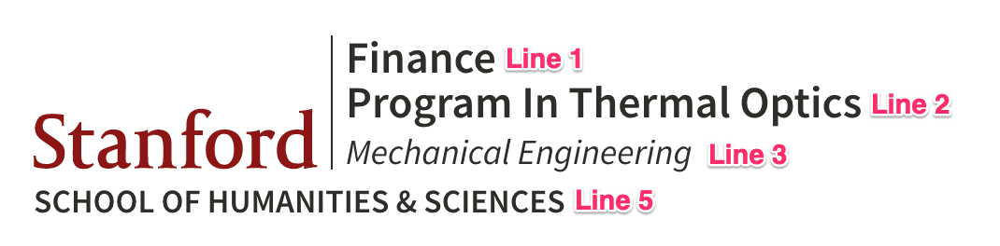
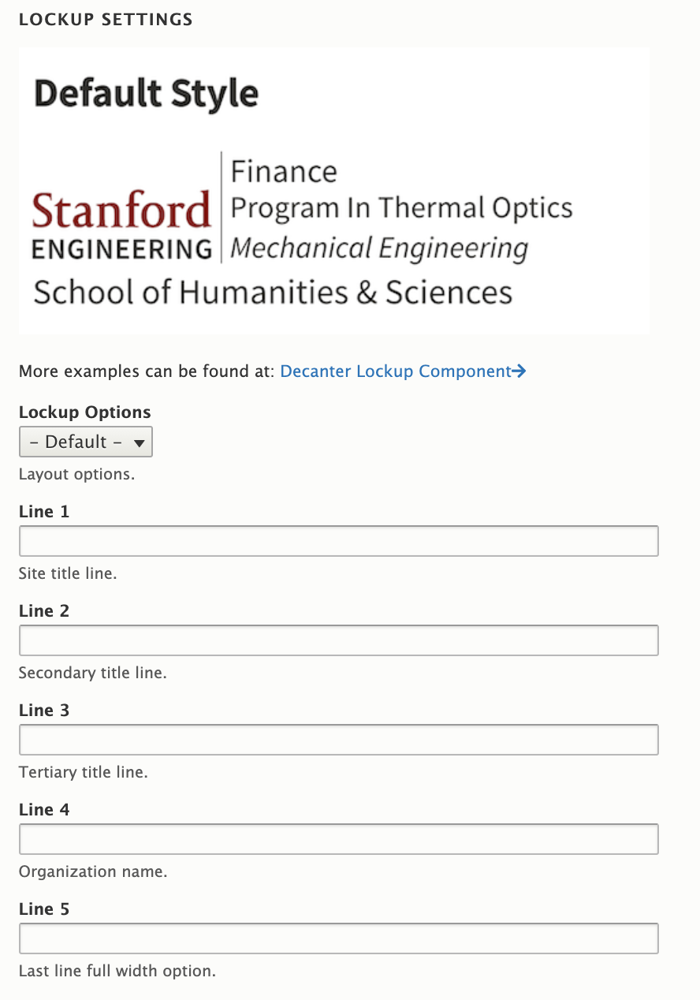

# Lockup Styles

| Masthead Theme Setting | Small Screen | Large Screen |
| ---------------------- | ------------ | ------------ |
| Default (light) | ![Default Small Screen] | ![Default Large Screen] |
| Dark Inversion | ![Default Small Screen Dark Inversion] | ![Default Large Screen Dark Inversion] |

[Default Small Screen]: ./images/lockup-styles/default-small-screen.png
[Default Large Screen]: ./images/lockup-styles/default-large-screen.png
[Default Small Screen Dark Inversion]: ./images/lockup-styles/default-small-screen-dark-inversion.png
[Default Large Screen Dark Inversion]: ./images/lockup-styles/default-large-screen-dark-inversion.png

---

## Anatomy of a Lockup

## Lockup Modifications

### Humsci Theme Differences

The Humsci Basic Lockup styles inherit the [Decanter Lockup](https://decanter.stanford.edu/component/identity-lockup/) styles with some modifications added for Humsci Basic themes. Site specific modifications can be added via the asset injector.

### Theme Options

**Lockup Options:** Lockup options are not used in Humsci Basic themes. Options A-T should only be used with caution.

**Lines 1-5:** Humsci Basic themes use all of the line options except for line 4. Only use line 4 with caution.
