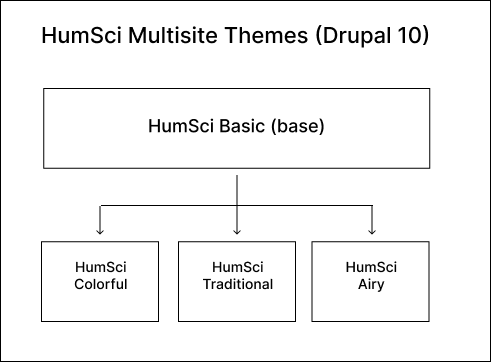

# Humsci Basic (humsci_basic) Theme

Humsci Basic (humsci_basic) is a theme that can be used as a base for future H&S themes. We have pulled patterns and templates for Humsci Basic from Stanford Basic (stanford_basic) Theme.



## Requirements

- Drupal 10.3.0
- Node 22

## Sub-themes

There are currently 3 children sub-themes based on Humsci Basic. Themes reference built CSS files in Humsci Basic on a per-theme basis in their `{}.libraries.yml`.

- Humsci Colorful (humsci_colorful)
- Humsci Traditional (humsci_traditional)
- Humsci Airy (humsci_airy)

> **_NOTE:_**  The Humsci Airy (humsci_airy) theme is not currently being used in any site. It is a placeholder for a potential future theme.

## Getting Started

This theme contains its own node module dependencies and build system which is separate from the root project. All commands should be run from this theme's directory.

- `npm install` - Install all node dependencies

## Builds

Frontend assets are built using the Grunt task runner, but are run using npm scripts as shortcuts. CSS assets are compiled to their respective child theme `css/` directory. JS assets are compiled to the `scripts/build/scripts.js` file.

- `npm start` - Runs the build task followed by the watch task
- `npm run build` - Compile Sass and JS for production
- `npm run watch` - Compile a CSS and JS build and watch for changes in the existing `.scss` or `.js` files

### Browserslist
In our `.browserlistrc` file we specify support for `"last 1 major version"` of each modern browser. As browsers update we need to refresh our it's a good idea to update the browserslist in the `package-lock.json` file. This is done by running `npx browserslist@latest --update-db` and committing the lock file. [More information](https://github.com/browserslist/browserslist#browsers-data-updating).

## Testing

### Linting

We use [stylelint](https://stylelint.io/) to lint all of our Sass code to maintain a consistent code style. To test it you can run: `npm run lint:sass`

Our linting rules use the [Sparkbox Stylelint Config](https://github.com/sparkbox/stylelint-config-sparkbox) as a base for our linting rules.

## Visual Regression Testing

### Percy

- `npm run visreg` - Runs percy script to test the visual regression of both the
Colorful and Traditional sites.

To run this, you will be required to be a member of the organization on Percy.io
and have a local Percy token. To use the Percy token, acquire it from Percy.io
under 'Project Settings'. Copy and paste the entire line under 'Project Token'
line into your `.bashrc` or `.zshrc` file located in your `$HOME` directory as `export PERCY_TOKEN=XXX`.

( Alternatively, you can include that token in a `.env` file in this directory `humsci_basic/` that is at the same level as package.json. )

The pages tested are located in the `tests/percy/.snapshots-colorful.js` and `tests/percy/.snapshots-traditional.js` respectively. To test the sites individually, you can run

`npm run visreg:colorful` and `npm run visreg:traditional`.

In order to have consistent testing, we need to ensure certain features are
enabled/disabled before testing. These include:
* The Colorful site should use the new V2 Megamenu
* The Traditional site should use the standard dropdown menu
* Both Colorful and Traditional sites should have the 'Use Animation Enhancements' feature turned off on their respective theme settings.

### BackstopJS
[Backstopjs](https://github.com/garris/BackstopJS) is a CLI visual regression tool that uses headless Chrome.

The visual regression tests are run locally and used to compare what is on Staging versus what is on the Dev environment. Backstop is setup to test two identical sites (pages and content) with the only difference being the theme they use.
- [HS Colorful](https://hs-colorful.stanford.edu/)
- [HS Traditional](https://hs-traditional.stanford.edu/)

#### Initial Setup
Before running Backstop for the first time you will need to create an `.env` file in this theme directory. Copy the contents in `docroot/themes/humsci/humsci_basic/.env-sample` and place them in your `.env` file. Add the basic auth credentials.

#### Testing Prep
Visual regression testing should be completed bi-weekly at the end of each sprint. To get the best results, sync your local environment against staging before running Backstop:

1. Sync the dev environment with a copy of the staging database and files: `ddev blt humsci:copy-colorful hs_colorful.dev,hs_traditional.dev`
2. Update the [hs-traditional dev](https://hs-traditional-dev.stanford.edu/) site to use the Traditional theme
3. Set the dev environment to use the sprint build branch in Acquia

#### Running BackstopJS Tests
1. Cd the `humsci_basic` directory.
2. Run `npm run backstop:init` to save a copy of the Backstop config to `./backtop/backstop.js`.
3. Run `npm run backstop:reference` to generate reference images, in our case reference is staging.
4. Run `npm run backstop:test` to run the tests.
5. Backstop will open an HTML page that contains the report which highlights errors.
_Note: Differences in content will also be reported as failures. Some failures can result in images not loading fully before the snapshot is taken._

#### Adding new scenarios in the `backstop/backstop.json`.
- Any new page and its content need to be present in both the [HS Colorful](https://hs-colorful-stage.stanford.edu/) and [HS Traditional](https://hs-traditional-stage.stanford.edu/) sites on the staging environment.
- Add the resource path of the new page to the `testPages` array in `backstop/generate-backstop.js`
- If adding a new theme add the theme name to the `sites` array in `backstop/generate-backstop.js`

### Tugboat Visual Diff
[Tugboat Visual Diff](https://docs.tugboatqa.com/visual-diffs/) is a visual regression tool to visually diff changes to the preview of our sites.

When a Preview is built from a Base Preview, Tugboat can generate Visual Diff images to highlight any changes between the Base Preview and the new Preview.

#### To view Visual Diffs
In order to view Tugboat’s visual diffs, you must be using at least one Base Preview.

1. Click into the link to the Visual Diff Dashboard that is included on each PR along with the tugboat links.
2. Scroll down past the Services and Lighthouse Reports, and you’ll see the Visual Diffs pane.
3. Click into the Visual Diff for Mobile, Tablet or Desktop to see the diff.

Inside the diff, you’ll see a Before visualization on the left, an After visualization on the right, and a composite in the middle, which highlights changes to the page.

You’ll also see an option to Regenerate visual diffs; use this if you’ve updated your Base Preview, and want to see a new version of the visual diffs for this build.

> **_NOTE:_**
> To configure new pages to generate Visual Diffs, you need access to Tugboat configuration. If you don't have access, please ask any of the [Tugboat manage users](https://dashboard.tugboatqa.com/5db08be544c5fa63ef0e09f2/settings/) to help you to specify the relative URLs of the pages in the service definition.

## CSS / Sass
The CSS is organized using [Harry Roberts’](https://csswizardry.com) [Inverted Triangle CSS](https://www.xfive.co/blog/itcss-scalable-maintainable-css-architecture/) (ITCSS) organizational approach. This method is mixed with [Block Element Modifier](http://getbem.com/) (BEM) naming convention for class names throughout the Sass files.

### Namespacing

All classes, variables, and mixins that belong to the humsci_basic theme will
be prefixed with `hb-`.
Example classes: `.hb-card`, `.hb-card--horizontal`, `.hb-card__title`.

**NOTE:** Some legacy variables, mixins are other elements that were integrated
from [Decanter](https://github.com/SU-SWS/decanter) still use the `su-` prefix.
This pattern is deprecated and will be phased out in the future.

### SCSS Structure

Compiled CSS is split in multiple files, on a _per-component_ basis. This allows to define
separate libraries and load them only when a component is displayed, to reduce CSS size and improve
performance.

Shared SCSS is located in the `src/scss/partials` folder, filenames prefixed with a `_` according to SASS
convention. Those files can be imported into the SASS files that will generate the final CSS, located
into the `src/scss/humsci_colorful`, `src/scss/humsci_traditional` and `src/scss/humsci_airy` folders.
To indicate the SASS compiler to which theme belongs each file, it's necessary to define the
`$hb-current-theme`at the top of the file:

```scss
$hb-current-theme: 'traditional';
```

Compiled CSS files are exposed to drual via libraries are defined in the `.libraries.yml` file of
each subtheme and attached to the templates of each component (or a preprocess in some exeptional cases).

The `src/scss/partials` files also contains some special files:

- `_base-imports.scss`: variables, functions and mixins needed by most components.
- `_main.scss`: base styles that will be available in all pages.
- `ckeditor/_imports.scss`: styles for CKEditor.
- `preview/_preview.scss`: base styles for the paragraph previews available in the admin theme.


| Class References                                                                      |
|---------------------------------------------------------------------------------------|
| [Prefixing of Class Names](/docroot/themes/humsci/humsci_basic/docs/css-prefixing.md) |
| [Utility Classes](/docroot/themes/humsci/humsci_basic/docs/utility-classes.md)        |
| [Sass Mixins](/docroot/themes/humsci/humsci_basic/docs/mixins.md)                     |
| [Color Pairings](/docroot/themes/humsci/humsci_basic/docs/color-pairings.md)          |
