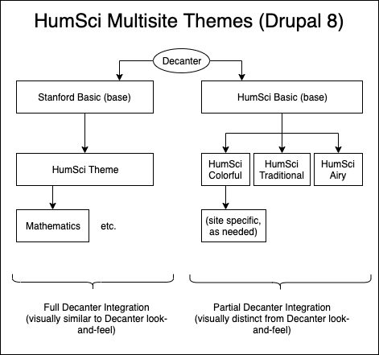

# Humsci Basic (humsci_basic) Theme

Humsci Basic (humsci_basic) is a theme that can be used as a base for future H&S themes. We have pulled patterns and templates for Humsci Basic from Stanford Basic (stanford_basic) and Stanford University Humsci Theme (su_humsci_theme) Themes. Humsci Basic integrates selectively with Decanter (v6) Sass, styles, and patterns.

## Requirements

- Drupal 8.7.10
- Node 10.15+

## Sub-themes

There are currently 3 children sub-themes based on Humsci Basic. Themes reference built CSS files in Humsci Basic on a per-theme basis in their `{}.libraries.yml`.

- Humsci Colorful (humsci_colorful)
- Humsci Traditional (humsci_traditional)
- Humsci Airy (humsci_airy)

## Getting Started

This theme contains its own node module dependencies and build system which is separate from the root project. All commands should be run from this theme's directory.

- `npm install` - Install all node dependencies

## Builds

Frontend assets are built using the Grunt task runner, but are run using npm scripts as shortcuts. Assets are compiled to a `dist/` directory with a stylesheet generated for each sub-theme.

- `npm run build:sass` - Compile Sass for production
- `npm run watch` - Compile a CSS build and watch for changes in the existing `.scss` files
- `npm run build:js` - Compile Javascript with Webpack

## Testing

- `npm test` - Run linting and Sass True tests

### Sass True

We use the [Sass True](https://github.com/oddbird/true) testing framework to test our Sass function and mixins.

### Linting

We use [stylelint](https://stylelint.io/) to lint all of our Sass code to maintain a consistent code style.

Our linting rules use the [Sparkbox Stylelint Config](https://github.com/sparkbox/stylelint-config-sparkbox) as a base for our linting rules.

## Contributing

### Commit Messages

We are using a conventional commit message format, e.g.:

`feat(STN-XX): descriptive message shorter than 80 chars`
`docs(STN-XXX): descriptive message shorter than 80 chars`

https://www.conventionalcommits.org/en/v1.0.0-beta.2/

### Green Button Merging

After receiving a review and getting a PR approved, we do green-button merges for our PRs ("Rebase and Merge") because Github includes a link to the PR in our commit message header.

## Decanter Integration

This theme aims to **partially** integrate [Decanter](https://github.com/SU-SWS/decanter). Instead of rendering all the styles generated by Decanter we:

- Import variables, function and mixins
- Compile various helpers classes
- Compile specific components such as Brand Bar, Logo, Lockup and Footer
